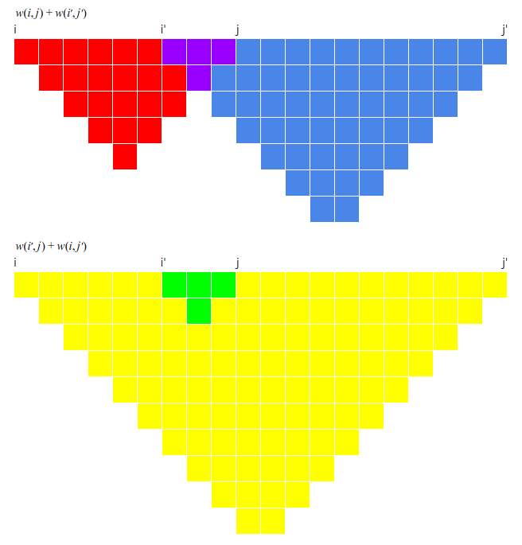

# Solution to LeetCode 1478 (Allocate Mailboxes)

## Naive DP solution

**The time complexity is O(n^3).**

We define `D(i,j)` as the minimum total distance to serve House `i` to House
`j` with exactly one mailbox. Using DP, the function D can be computed in
`O(n^2)` time.

```
D(i, j) = D(i+1,j-1) + P(j) - P(i)
```

We define `M(i,j)` as the minimum total distance to serve the first `i`
houses with `j` mailboxes. Using DP, the function `M(i,j)` can be computed in
`O(n^3)` time.

```
M(i,j) = min(M(c,j-1) + D(c,i-1))
for any c between j-1 and i-1
```

## Optimized DP solution

**The time complexity is O(n^2).**

The key idea is to reduce the search range for `c` in the induction rule.

We define `C(i,j)` as the leftmost best choice of `c` when we compute
`M(i,j)`. In other words, `C(i,j)` is the smallest `c` such that

```
M(i,j) = M(c,j-1) + D(c,i-1)
```

In the [naive DP solution](#naive-dp-solution), we conservatively think
`C(i,j)` may be any integer between `j-1` and `i-1`. However, we will prove
later that `C(i,j-1) <= C(i,j) <= C(i+1,j)`. Using this property, we can
signicantly reduce the search range when computing `M(i,j)` and therefore
speed up the algorithm from `O(n^3)` to `O(n^2)`.

Although it looks complicated, `C(i,j-1) <= C(i,j) <= C(i+1,j)` is intuitive.
First, to understand `C(i,j) <= C(i+1,j)`, imagine we append a new house to
the right of the house array without adding any mailbox. This new house must
be covered by the rightmost mailbox. Therefore, the leftmost house covered by
this mailbox will be either the same as before or to the right. Second, to
understand `C(i,j-1) <= C(i,j)`, imagine you want to cover the same house
array with one fewer mailbox. The leftmost house covered by the rightmost
mailbox will be either the same as before or to the left. If the above
intuitions are obvious to you, you can skip the proofs and jump to [this
section](#time-complexity) for why the time complexity can be reduced to
`O(n^2)` using the property `C(i,j-1) <= C(i,j) <= C(i+1,j)`.

### The quadrangle inequality of `D`

The function `D` satisfies [quadrangle
inequality](https://dl.acm.org/doi/10.1145/800141.804691): `D(i,j)+D(i',j')
<= D(i',j)+D(i,j')` for any `i <= i' <= j <= j'`.

The following figure demonstrates why `D(0,9)+D(6,20) <= D(6,9)+D(0,20)`.



We expand `D(0,9)`, `D(6,20)`, `D(6,9)` and `D(0,20)` to the linear
combination of distances between pairs of adjacent houses. Each column
represents the distance between two adjacent houses, and the depth of a
column represents the multiplier of the distance. For example,
`D(6,9) = [P(7)-P(6)]+2[P(8)-P(7)]+[P(9)-P(8)]` and it is represented by the
purple part. Note that the purple part is covered by both `D(0,9)` and
`D(6,20)` so we need to count it twice.

Putting it all together, 

```
D(0,9) + D(6,20) = (red + purple) + (purple + blue)
                 = (red + purple + blue) + purple
                 <= (yellow + green) + purple
                 = (yellow + green) + green
                 = D(0,20) + D(6,9)
```

### The quadrangle inequality of `M`

Interestingly, the function `M` satisfies a similar quadrangle inequality:

```
M(i,j) + M(i',j') <= M(i',j) + M(i',j)
as long as i <= i' and j <= j'
```

Let's prove this inequality by induction on `j'`. When `j'=1`, this
inequality is trivially true. Now assume the inequality holds for all the
smaller `j'`.

Denote `C(i,j')` by `x` and `C(i',j)` by `y`. If `x <= y`,

```
M(i,j) + M(i',j')
  = min(M(t,j-1) + D(t,i-1)) + min(M(t',j'-1) + D(t',i'-1))
  <= M(x,j-1) + D(x,i-1) + M(y,j'-1) + D(y,i'-1)
  <= M(x,j'-1) + D(x,i-1) + M(y,j-1) + D(y,i'-1)  # quadrangle inequality of M
  <= M(i,j') + M(i',j)
```

If `y <= x`,

```
M(i,j) + M(i',j')
  = min(M(t,j-1) + D(t,i-1)) + min(M(t',j'-1) + D(t',i'-1))
  <= M(y,j-1) + D(y,i-1) + M(x,j'-1) + D(x,i'-1)
  <= M(y,j-1) + D(y,i'-1) + M(x,j'-1) + D(x,i-1)  # quadrangle inequality of D
  <= M(i',j) + M(i,j')
```

### `C(i,j) <= C(i+1,j)`

Denote `C(i,j)` by `x` and `C(i+1,j)` by `y`. To prove `C(i,j) <= C(i+1,j)`
by contradition, we assume `x > y`.

Because `x` is the leftmost best choice for `M(i,j)`, we know that

```
M(i,j) = M(x,j-1) + D(x,i-1) < M(y,j-1) + D(y,i-1)

==>

M(x,j-1) - M(y,j-1) < D(y,i-1) - D(x,i-1)  # (1)
```

Similarly, because `y` is a best choice for `M(i+1,j)`, we know that

```
M(i+1,j) = M(y,j-1) + D(y,i) <= M(x,j-1) + D(x,i)

==>

M(x,j-1) - M(y,j-1) >= D(y,i) - D(x,i)  # (2)
```

Combining (1) and (2), we get

```
D(y,i-1) - D(x,i-1) > D(y,i) - D(x,i)

==>

D(y,i-1) + D(x,i) > D(y,i) + D(x,i-1)
```

which contradicts the quadrangle inequality of `D`.


### `C(i,j-1) <= C(i,j)`

Denote `C(i,j-1)` by `x` and `C(i,j)` by `y`. To prove `C(i,j-1) <= C(i,j)`
by contradition, we assume `x > y`.

Because `x` is the leftmost best choice for `M(i,j-1)`, we know that

```
M(i,j-1) = M(x,j-2) + D(x,i-1) < M(y,j-2) + D(y,i-1)

==>

D(y,i-1) - D(x,i-1) > M(x,j-2) - M(y,j-2)  # (3)
```

Similarly, because `y` is a best choice for `M(i,j)`, we know that

```
M(i,j) = M(y,j-1) + D(y,i-1) <= M(x,j-1) + D(x,i-1)

==>

D(y,i-1) - D(x,i-1) <= M(x,j-1) - M(y,j-1)  # (4)
```

Combining (3) and (4), we get

```
M(x,j-1) - M(y,j-1) > M(x,j-2) - M(y,j-2)

==>

M(y,j-2) + M(x,j-1) > M(y,i-1) + M(x,j-2)
```

which contradicts the quadrangle inequality of `M`.

### Time complexity

With the property `C(i,j-1) <= C(i,j) <= C(i+1,j)`, we can simplify the
induction rule in the [naive DP solution](#naive-dp-solution) to

```
M(i,j) = min(M(c,j-1) + D(c,i-1))
for any c between C(i,j-1) and C(i+1,j)
```

Therefore, the time complexity to compute the matrix `M` and `C` equals

```
O(sum(C(i+1,j) - C(i,j-1))) for any 1 <= j <= k and j <= i <= n
```

In each major diagonal of the matrix `C`, all cells other than the rightmost
cell will be canceled out. Since `C(i,j) <= n` for any `i` and `j`, the time
complexity to compute `M` and `C` is `O(n^2)`. As mentioned in the [naive DP
solution](#naive-dp-solution), the time complexity to compute `D` is also
`O(n^2)`. Therefore, the total time complexity is `O(n^2)`.
